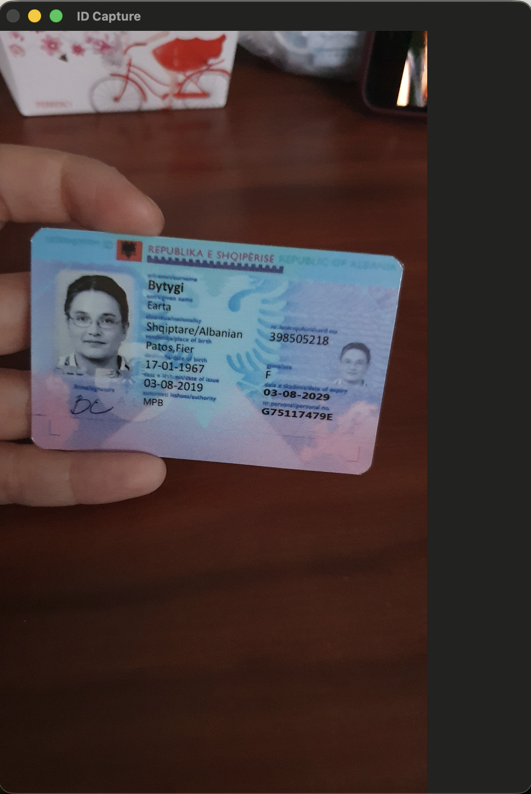
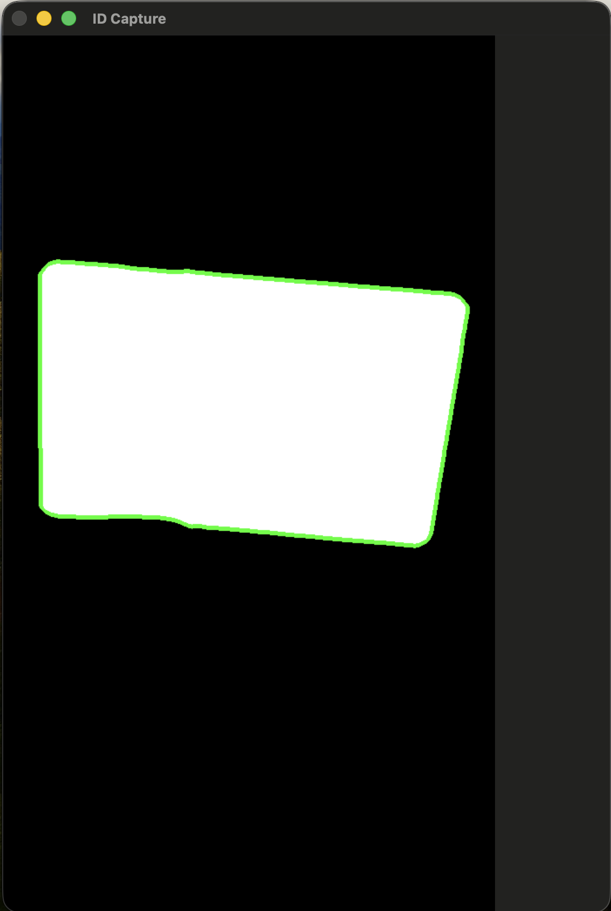

# ID Capture

### Usage

```python
from app.corners import Corners


def make_app():
    print(f"Starting...")
    corners = Corners("data/88.jpg", debug=False)
    corners.load_image()
    is_card = corners.is_card()
    corners.show()

    print(f"Does a card exist in the image: {is_card}")

```
| Original | Processed |
|:--------:|:---------:|
|  |  |
